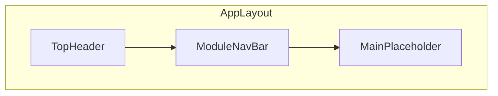

# COSCO SHIPPING Agentic DSS 界面复刻计划（v1）

| 字段 | 内容 |
| --- | --- |
| 版本 | v1 |
| 文档路径 | `plan/v1.md` |
| 项目目录 | 仓库根目录 `DSS` |
| 参考界面 | `reference-ui.png` |

## 概览

在 DSS 目录内用 Vite + React + TypeScript 搭建静态壳层，按 `reference-ui.png` 还原顶栏、分组图标导航与主内容占位，便于后续接业务路由与数据。

## 目标与范围

- **目标**：实现与 `reference-ui.png` 一致的**布局与视觉**（深蓝顶栏、浅灰二级导航分组、选中态、主内容空白区）。
- **不在首版范围**：各菜单对应的真实页面、接口、权限；仅保留可点击占位与可选的简单 `active` 状态切换。

## 技术选型

| 方案 | 说明 |
| --- | --- |
| **推荐** | **Vite + React 18 + TypeScript**：与常见企业前端一致，易扩展。 |
| **UI 库** | **Ant Design 5 + @ant-design/icons**：与截图中的企业后台风格接近，图标与 Input/Button 开箱即用；顶栏可用 `Layout.Header`、浅底 `Input` 搜索框对齐。 |
| **字体** | `index.html` 引入 **Noto Sans SC**（或系统栈 `PingFang SC`、`Microsoft YaHei`）保证中文与数字一致。 |

若希望**零依赖 UI 库**（更小包体），可改为纯 CSS + 内联 SVG；实现量略增，但布局结构不变。

## 页面结构（组件拆分）

1. **TopHeader**（深蓝背景，约 `#001529`～`#1a2a4e`）
   - 左：COSCO 标识区（可用 `reference-ui.png` 裁切 logo 放 `public/`，或文字占位 + 后续换图）+ 文案「Agentic DSS」+ 汉堡菜单图标。
   - 中：搜索区——前缀「AI-BULK」+ 圆角 `Input`，占位符「输入文字检索案件、入口、文件...」，右侧搜索图标。
   - 右：工具项竖排图标+标签：邮箱、BMS、OA、航标、票控、通讯录、用户「安超」（与图一致即可）。

2. **ModuleNavBar**（浅灰底 `#f0f2f5` / 白底）
   - 使用 **flex + 竖线分隔** 的多个 `group`；每组内为 **上图标下文字** 的 `NavItem`。
   - 组底 **居中分类标题**（如「航次动态监控」「市场船行为分析」等），文案以图为准（注意：图中为「应收账款」时以截图为准）。
   - **选中态**：「主要船东」——浅蓝底 + 蓝色描边（或整项蓝底白字，以 png 为准微调）。
   - **待办待阅**：红色数字角标「2」。
   - **右侧**：灰色圆形/六边形内的设置齿轮（与图一致即可）。

3. **MainPlaceholder**
   - 占满剩余视口高度，背景 `#f5f5f5`，内部可放一句「内容区占位」或留空。

全局：`min-height: 100vh`，顶栏与二级导航可 `position: sticky` 或固定高度，避免首屏滚动错位。

## 数据与状态

- 将各组菜单项抽成 **常量数组**（`id`, `label`, `icon`, `groupLabel`, `badge?`），用 `.map` 渲染，便于以后接路由：`/major-shipowners` 等。
- 使用 `useState` 保存当前选中 `navId`（默认「主要船东」）。

## 文件规划（新建）

在 DSS 下初始化 Vite React TS 后，主要文件：

- `package.json` — 依赖：`react`, `react-dom`, `antd`, `@ant-design/icons`；dev：`vite`, `@vitejs/plugin-react`, `typescript`。
- `vite.config.ts`、`tsconfig.json`、`index.html`。
- `src/main.tsx`、`src/App.tsx` — 挂载 `ConfigProvider`（`locale: zhCN`，主题色贴近 `#1890ff`）。
- `src/layout/TopHeader.tsx`、`src/layout/ModuleNavBar.tsx`、`src/layout/AppLayout.module.css`（或同级 `*.css`）。
- `src/data/navConfig.ts` — 分组与菜单元数据。
- 可选：`public/logo-cosco.png` — 从参考图导出或使用现有品牌素材。

## 验收标准

- 浏览器全宽下：顶栏、二级导航分组、分隔线、选中项、待办角标、搜索框、右侧工具区与参考图**结构一致**；配色与间距**肉眼接近** png。
- `npm run dev` 可本地预览；`npm run build` 无 TypeScript 错误。

## 实施顺序

1. 若目录非空，在子目录初始化或清空后执行 `npm create vite`（避免与现有文件冲突）。
2. 安装 `antd`、`@ant-design/icons`，配置中文与主题色。
3. 实现 `TopHeader` → `ModuleNavBar` → 主占位，用 `navConfig` 驱动渲染。
4. 对照 `reference-ui.png` 微调 padding、字体大小、active 边框与组标题位置。
5. 运行 `npm run build` 确认通过。

## 实施任务清单（v1 记录）

以下为当时计划中的任务项，便于对照实现与后续版本迭代：

- 在 DSS 初始化 Vite+React+TS（处理目录非空：子目录或清理）
- 安装 antd、@ant-design/icons，ConfigProvider zhCN + 主题色
- 实现 TopHeader：Logo/标题/搜索/右侧工具项
- 实现 ModuleNavBar：分组、分隔线、选中态、待办角标、设置按钮
- 抽取 navConfig 常量与可选选中 state
- 对照 reference-ui.png 微调样式并 `npm run build` 验证
